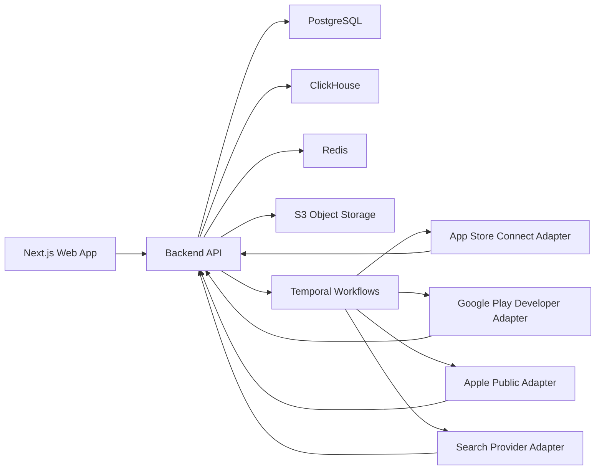

# PRD + Architecture: ASO Intelligence Platform for Agencies

## Summary

Build a multi-tenant SaaS for ASO agencies to track App Store and Google Play performance for client apps and competitors. V1 is a tracking-first product with global market coverage, daily baseline refresh, first-party store connections for owned apps, public intelligence for competitor apps, and first-class exports/reports. AI is explicitly out of scope for the core release.

Primary goals:
- Give agencies one workspace for app metadata, keyword positions/history, ratings, reviews, and competitor monitoring.
- Combine trustworthy first-party data for owned apps with public market intelligence for competitors.
- Make reporting operationally useful: dashboards, CSV exports, and scheduled branded reports.

Success criteria:
- A new agency can connect stores, add tracked apps/competitors, upload keywords, and get first dashboards within 30 minutes.
- 95% of scheduled metadata and rank snapshots complete within 24 hours.
- 95% of on-demand refreshes for tracked entities complete within 60 minutes.
- Weekly/monthly branded reports generate successfully for 99% of scheduled runs.

## Product Requirements

Core personas:
- Agency admin managing multiple clients and team members.
- ASO specialist tracking keyword movement, metadata changes, and review health.
- Client stakeholder consuming reports and exports.

V1 user workflows:
- Create workspace, invite teammates, create client accounts, and assign apps to clients.
- Connect App Store Connect and Google Play Developer for owned apps.
- Add competitor apps by App Store ID / bundle ID / package name.
- Create keyword lists per store, country, and language.
- View daily metadata snapshots, keyword rank history, rating trends, and review streams.
- Set alerts for rank drops, rating drops, metadata changes, and review spikes.
- Export CSVs and schedule branded weekly/monthly reports per client.

V1 feature set:
- Workspace and client management.
- Store account connections for Apple and Google.
- App catalog with owned-app and competitor-app flags.
- Metadata tracking: name, subtitle or short description, description, full description, screenshots, icon, rating, rating count, version, category, developer, installs range where available, update date, and change history.
- Keyword tracking: current rank and historical rank per app, keyword, store, country, language, and measurement surface.
- Review monitoring: owned-app reviews via official APIs; competitor reviews via public provider where supported.
- Reporting: dashboard exports, scheduled CSV, and scheduled branded PDF summary.
- Manual keyword import and bulk CSV upload.
- On-demand refresh with quota controls.

Explicitly out of scope for V1:
- AI recommendations, AI-written metadata, creative testing, and automated store write-backs.
- Apple hidden-keyword inference as a first-class feature.
- Real-time rank streaming.

## Architecture

System shape:

Chosen stack:
- Frontend: Next.js web app with server-rendered dashboards and authenticated exports.
- Backend: TypeScript service layer exposing REST APIs and background job endpoints.
- Workflow orchestration: Temporal for scheduled refreshes, retries, backfills, throttling, and report generation.
- Primary OLTP store: PostgreSQL for tenants, users, apps, keywords, connections, alert rules, and report configs.
- Analytics store: ClickHouse for rank snapshots, metadata snapshots, review events, and report queries.
- Cache/queue support: Redis for short-lived cache, locks, and request rate control.
- Raw payload store: S3-compatible object storage for provider responses, report artifacts, and screenshot/icon assets.

Provider strategy:
- Apple owned-app data: App Store Connect API.
- Apple competitor metadata: iTunes Search API first; public page or search provider fallback only for missing fields.
- Apple competitor search rank and public reviews: managed provider abstraction, with SerpApi as primary and SearchAPI as fallback.
- Google owned-app data: Android Publisher API.
- Google competitor metadata, search rank, and public reviews: managed provider abstraction, with SerpApi as primary and SearchAPI as fallback.
- Apify-style actors are reserved for backfills or provider outages, not the default online path.

Data collection cadence:
- Metadata snapshots: daily for all tracked apps and competitors.
- Keyword ranks: daily for every tracked keyword/app/store/country/language combination.
- Owned-app reviews: incremental every 6 hours.
- Competitor public reviews: daily.
- On-demand refresh: user-triggered, rate-limited, available for apps, keywords, and reports.

Measurement policy:
- App Store rank is measured on one canonical search surface per storefront and locale and stored with source provenance.
- Google Play rank is measured on one canonical web search surface per `gl` and `hl` pair and stored with source provenance.
- History is append-only; snapshots are never overwritten.

Security and tenancy:
- Multi-tenant by workspace, with client containers under a workspace.
- Roles: owner, admin, analyst, viewer.
- All records carry `workspace_id`; all analytics queries are tenant-filtered server-side.
- Store credentials are encrypted at rest; Apple uses API key/JWT configuration, Google uses service account credentials.
- Audit log is required for connections, exports, report schedules, and manual refreshes.

## Interfaces and Core Data Contracts

Canonical entities:
- `workspace`, `client`, `member`, `store_connection`, `app`, `app_market`, `competitor_group`, `keyword_list`, `tracked_keyword`, `alert_rule`, `report_schedule`.
- `metadata_snapshot` keyed by `app_id + store + country + language + captured_at`.
- `rank_snapshot` keyed by `app_id + keyword_id + store + country + language + surface + captured_at`.
- `review_event` keyed by `store_review_id + store + app_id`.
- `asset_record` for icons and screenshots with source URL, normalized URL, checksum, and captured time.
- `source_provenance` on every snapshot with `provider`, `method`, `request_fingerprint`, and `raw_payload_uri`.

Public API surface for V1:
- Auth and workspace APIs.
- Store connection APIs for Apple and Google.
- App registration/import APIs for owned and competitor apps.
- Keyword list CRUD and bulk upload APIs.
- Snapshot query APIs for metadata history, rank history, ratings, and reviews.
- Refresh APIs for app, keyword list, and report regeneration.
- Export/report APIs for CSV and PDF generation and schedule management.

Defaults that remove ambiguity:
- Keywords are user-supplied in V1 via manual entry or CSV upload.
- Localization dimension is mandatory for rank tracking and optional-but-supported for metadata display.
- Google historical review backfill for owned apps is supported through CSV import from Play Console if API history is insufficient.
- Reports are client-scoped, branded per workspace, and available as weekly or monthly schedules.

## Test Plan

Functional scenarios:
- Connect App Store Connect and Google Play accounts and ingest owned-app metadata successfully.
- Add competitor apps on both stores and ingest public metadata successfully.
- Create keyword lists across multiple countries/languages and produce daily rank snapshots.
- Detect metadata changes between snapshots and surface them in the UI and exports.
- Ingest owned-app reviews incrementally and competitor reviews via public provider where supported.
- Generate branded weekly and monthly reports with correct client scoping.

Reliability and correctness:
- Contract-test every provider adapter against saved fixtures and schema validation.
- Verify fallback provider routing when the primary vendor fails or returns partial payloads.
- Validate de-duplication for reviews, assets, and repeated rank captures.
- Verify timezone-safe scheduling for global report runs and daily ingestion windows.
- Verify tenant isolation across API, analytics queries, exports, and report artifacts.
- Load-test daily rank capture volume at projected global launch capacity.

Acceptance thresholds:
- 95% daily snapshot completeness within 24 hours.
- 99% export generation success.
- 0 cross-tenant data leakage in permission and analytics tests.
- Rank history remains queryable by app, keyword, market, and date range under acceptable dashboard latency.

## Assumptions and Defaults

- First launch customer is agencies, not single-team app publishers.
- Global coverage means all supported storefronts/locales from the providers are technically supported; the UI will still default to common markets first.
- Daily baseline is the default service level; intraday rank tracking is a later paid tier, not part of V1.
- No AI subsystem is included in the initial architecture beyond optional future extension points.
- Vendor-first collection is intentional to reduce time-to-market; a later phase can replace expensive or unstable provider paths with owned scrapers where justified by cost and volume.
